# Nom List

An app that helps you track and rate restaurant visits.

### Working Prototype

View React working prototype here: [Nom List](https://restaurant-list-react.herokuapp.com/)
View Node working prototype here: [Nom List](https://restaurant-list-node.herokuapp.com/)

## Site Map: MVP

## UX & User Stories: MVP

**All Lists**

As a user, I want to be able to view all the restaurant lists I've made, so that I can select a list to view.

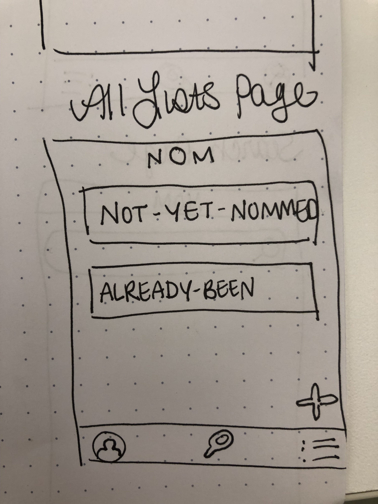

**Add New List Page**

As a user, I want to be able to add a new list so that I can track restaurants that I would like to visit.

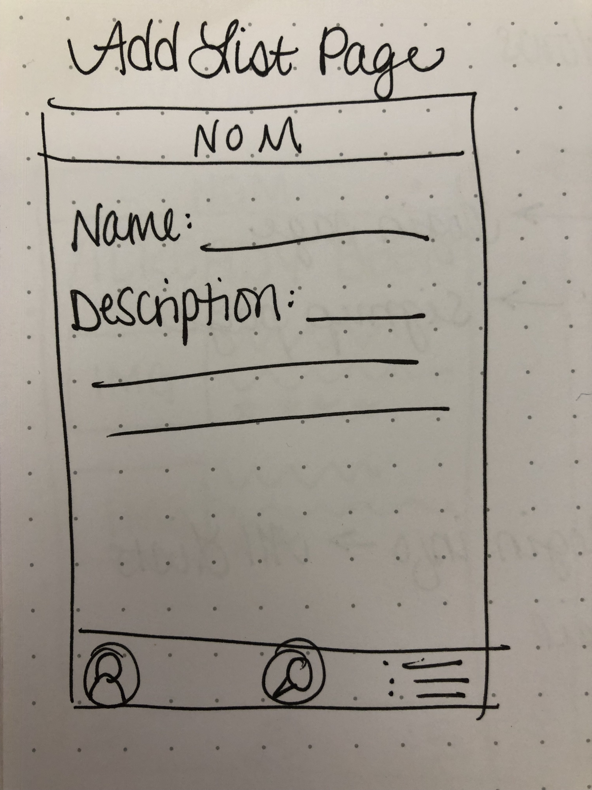

**Individual Restuarant Page**

As a user, I want to be able to view an individual restaurant so I can see detailed information about it, add notes, and ratings.

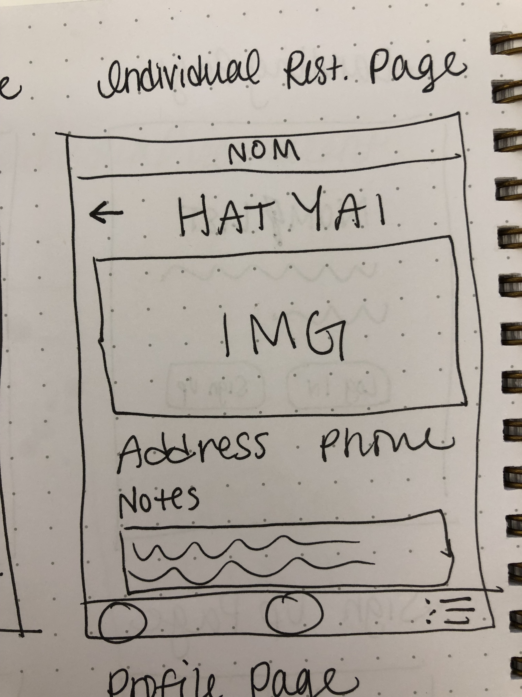

**Individual List Page**

As a user, I want to be able to view an individual list, so that I can see what restaurants I've added to that list.

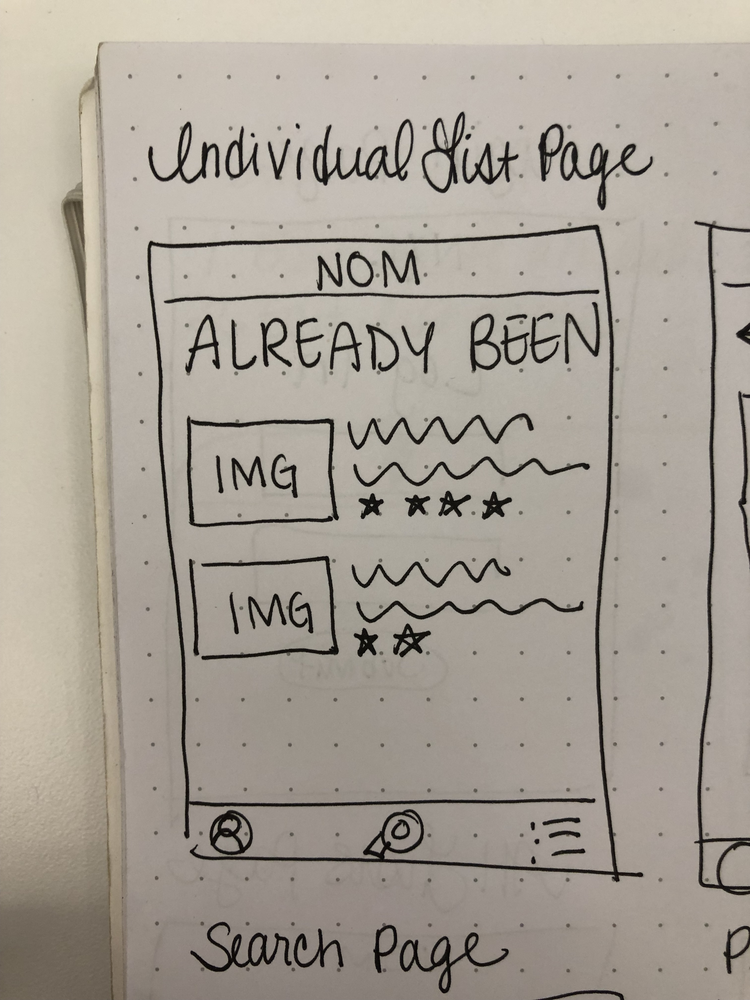

**Search Page**

As a user, I want to be able to search for restaurants to add to a list.

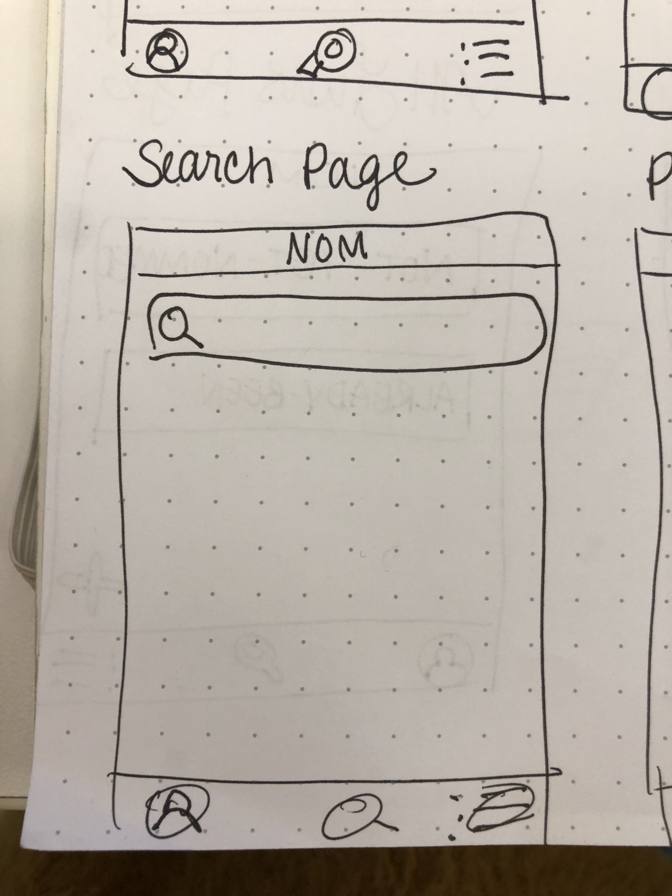

## Designs

**Landing Page**

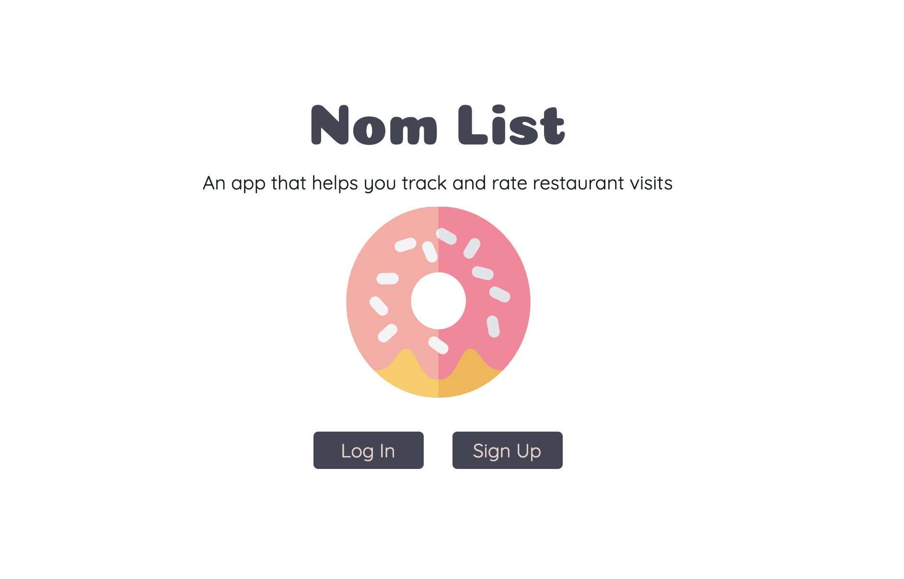

**Signup Page**

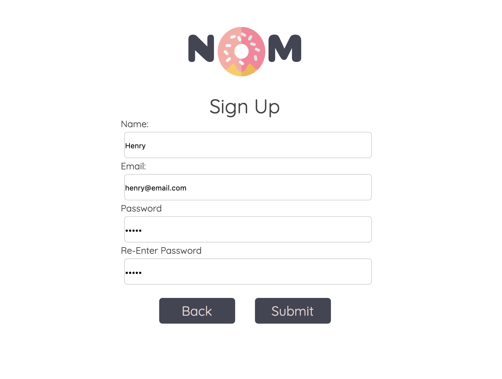

**All Lists Page**

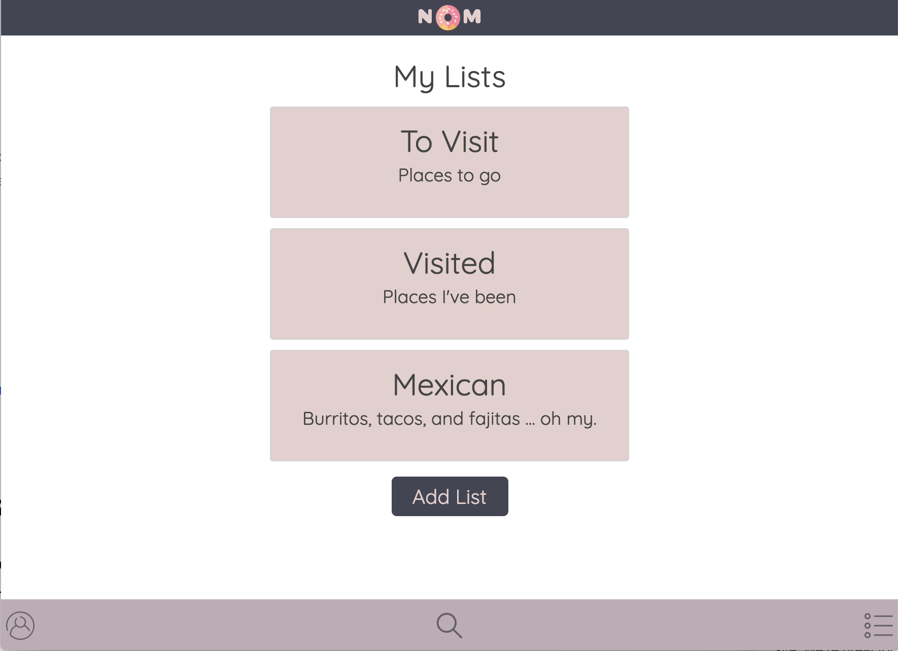

**Add New List Page**

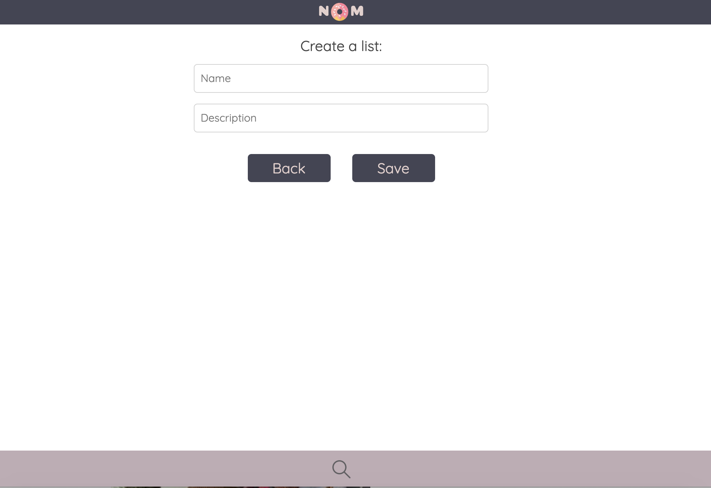

**Individual Restaurant Page**

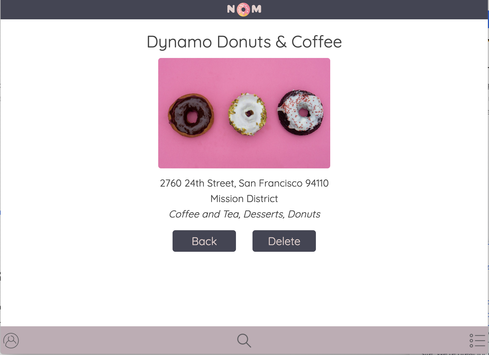

**Individual List Page**

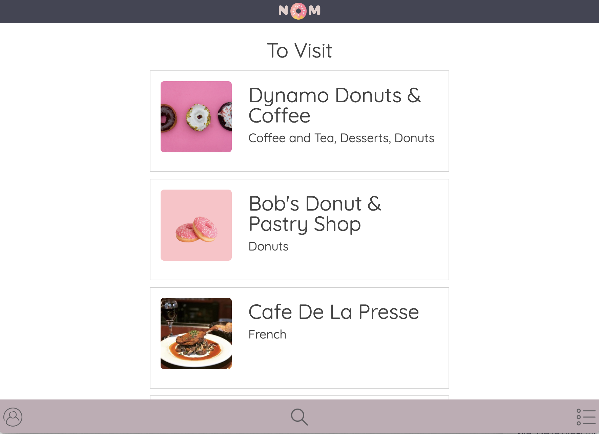

**Search Page**

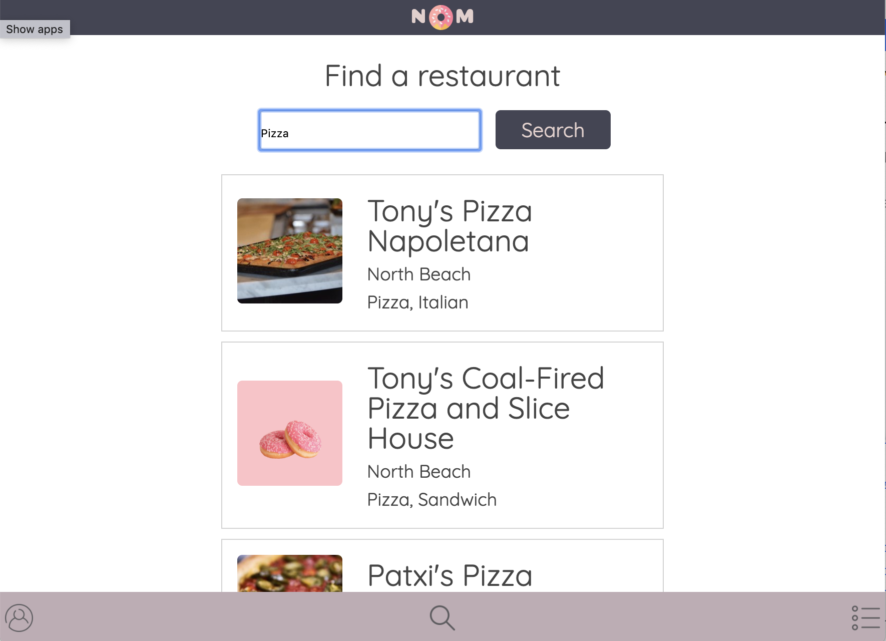

**Profile Page**

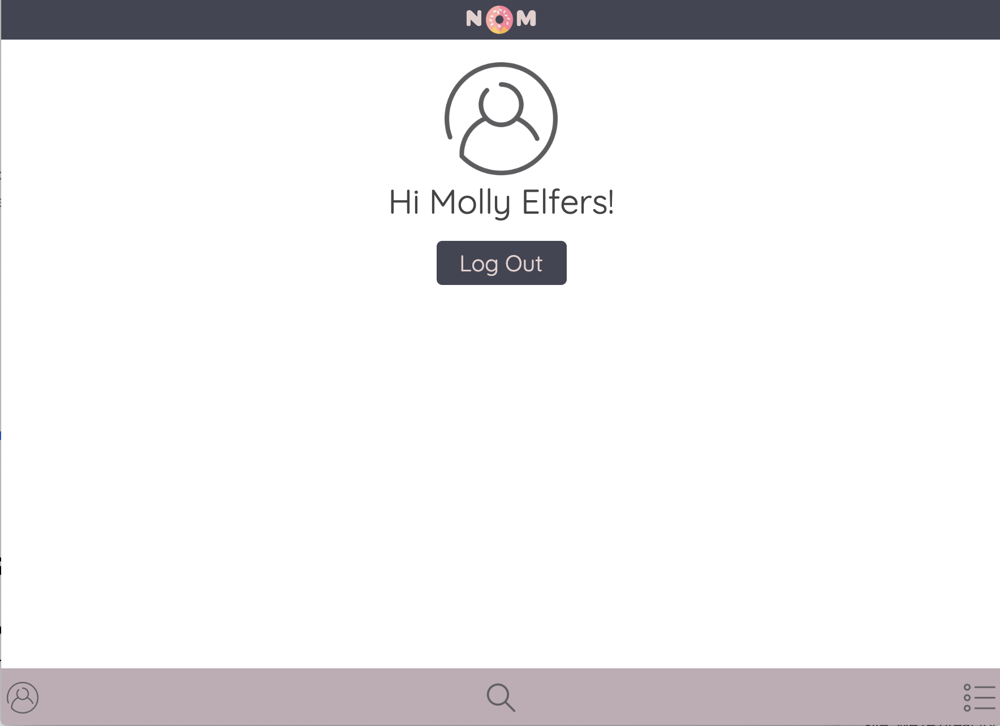

## Technical

Nom List was built with:

**Front End**

- HTML5
- CSS3
- JavaScript
- React
- Redux

**Back End**

- Node.js
- Express.js
- MongoDB
- Mongoose
- mLab database
- Mocha and Chai for testing

**Responsive**

This app is built to be responsive to smaller screen sizes using a media screen width breakpoint of 480px for smaller screen sizes.
